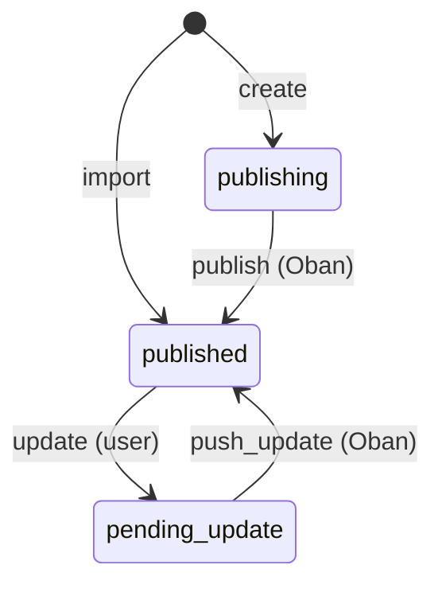

<!--
SPDX-License-Identifier: Apache-2.0
SPDX-FileCopyrightText: 2026 Erlang Ecosystem Foundation
-->

# ADR-013: CveRecord State Machine, Async MITRE Publishing, and MITRE Import

**Status**: Superseded by [ADR-019](019-unified-cve-record-lifecycle.md)

## Context

Publishing a CVE record to MITRE CVE Services and keeping it in sync requires:

1. A DB write that is transactionally safe — the record must exist before any
   external call is made, and the final published state must be persisted after
   success.
1. A call to the MITRE CVE Services API (`PUT /cve/{id}/cna`) which is a remote
   HTTP operation that can fail, time out, or succeed after a retry.
1. A full record fetch (`GET /cve/{id}`) after publish to capture the
   server-assigned `datePublished` and the final canonical JSON blob.
1. Idempotency: if an Oban job is retried and the CVE was already published on
   a previous attempt, the worker must succeed rather than error or
   double-publish.
1. Syncing: MITRE may update metadata server-side; the local record must stay
   current.
1. Import: CVEs published on MITRE that do not yet exist locally should be
   importable without going through the normal publish flow.

## Decision

### 1. State machine

`CveRecord` uses `ash_state_machine` with the following states and transitions:



| State | Meaning |
| --- | --- |
| `publishing` | Record created; Oban publish job enqueued |
| `published` | MITRE accepted the record; `cve_json` and `published_at` set |
| `pending_update` | User submitted new `cve_json`; Oban push_update job enqueued |

Both `:publishing` and `:published` are valid initial states. `:published` is
only used by the `:import` action (see §4).

### 2. Oban triggers for publish and push_update

Two `ash_oban` triggers fire when a record enters the relevant state:

| Trigger | State | Action called | Cron (safety net) |
| --- | --- | --- | --- |
| `:publish` | `publishing` | `:publish` | `*/15 * * * *` |
| `:push_update` | `pending_update` | `:push_update` | `*/15 * * * *` |

Both triggers are also invoked immediately via `run_oban_trigger/1` in the
`:create` and `:update` actions respectively, so the job is enqueued in the
same transaction rather than waiting for the scheduler sweep.

Workers are deduplicated with
`unique: [period: :infinity, states: :incomplete, keys: [:primary_key]]`
to prevent the scheduler from double-enqueueing.

### 3. Sync from MITRE

A third `ash_oban` trigger (`sync_from_mitre`) runs daily (`0 2 * * *`) for
every `:published` record. The worker fetches the current state from MITRE via
`GET /cve/{id}` and updates `cve_json` locally if MITRE has a newer
`dateUpdated`.

### 4. Import from MITRE

A daily scheduled action (`import_from_mitre`) uses the `scheduled_actions`
block in the `oban` DSL (not a trigger). It:

1. Calls `GET /cve-id?state=PUBLISHED` on the MITRE API, paging through all
   published CVE IDs owned by the org.
1. For each ID, fetches the full record via `GET /cve/{id}`.
1. Bulk-creates records in chunks of 100 using the `:import` action.

The `:import` action creates records directly as `:published` and uses
`upsert_identity: :unique_cve_id` with `upsert_fields: [:state]` so that
re-importing an existing CVE is a no-op. The unique index on
`cve_json->'cveMetadata'->>'cveId'` (via the `unique_cve_id` identity and
`calculations_to_sql`) enforces uniqueness at the database level.

### 5. Idempotency

Both `:publish` and `:push_update` actions check the record's current state at
the start of the worker: if it is already `:published`, the action returns
immediately without making any API call.

### 6. MITRE CVE Services API

| Purpose | Method | Path |
| --- | --- | --- |
| Submit / update CNA container | `PUT` | `/cve/{id}/cna` |
| Fetch full published record | `GET` | `/cve/{id}` |
| List published CVE IDs | `GET` | `/cve-id?state=PUBLISHED` |

Auth headers on every request: `CVE-API-ORG`, `CVE-API-USER`, `CVE-API-KEY`.

Base URLs:

- Staging (dev/test): `https://cveawg-test.mitre.org/api`
- Production: `https://cveawg.mitre.org/api`

### 7. Configuration

All credentials are read at runtime from environment variables:

```text
MITRE_CVE_API_BASE_URL
MITRE_CVE_API_ORG
MITRE_CVE_API_USER
MITRE_CVE_API_KEY
```

Dev uses staging credentials stored in `.env` (gitignored), loaded via
`devenv.nix` dotenv integration and read in `runtime.exs`.

## Consequences

- The `CveRecord` lifecycle is fully observable: state transitions are tracked
  via Ash Events, job history is visible in Oban Web.
- Workers are idempotent: safe to run multiple times for the same record.
- `5xx` / network errors cause Oban to retry with exponential backoff up to
  `max_attempts` (3). The job failure is visible in Oban Web.
- The import workflow keeps the local DB in sync with MITRE without manual
  intervention; the unique index prevents duplicates.
- `cve_json` is the single source of truth for CVE content; it is set from
  the MITRE API response after every successful publish, push_update, sync,
  or import.
