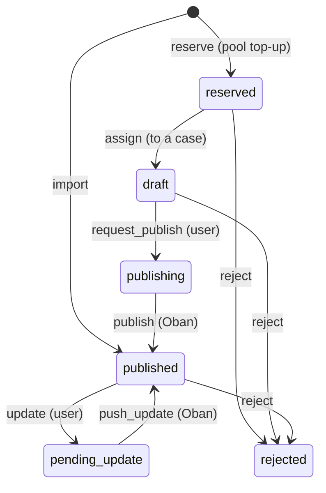

<!--
SPDX-License-Identifier: Apache-2.0
SPDX-FileCopyrightText: 2026 Erlang Ecosystem Foundation
-->

# ADR-019: Unified CveRecord Lifecycle

**Status**: Accepted

**Supersedes**: [ADR-013](013-cve-record-state-machine-and-publishing.md),
[ADR-014](014-cve-id-reservation-pool.md)

## Context

ADR-013 and ADR-014 modelled a CVE ID as two separate resources:

- `CveReservation` — an ID reserved from MITRE, tracked in `cve_reservations`,
  with its lifecycle encoded purely in `case_id` (`NULL` = open pool,
  set = assigned). Deleted on publish or rejection.
- `CveRecord` — the published record, tracked in `cve_records`, with an
  `ash_state_machine` covering `publishing → published → pending_update`.

In practice these are the same MITRE-owned CVE ID at different lifecycle
stages. The split caused real friction:

- The `cve_id` identity existed in both tables, enforced separately.
- Publishing destroyed a row in one table and created a row in the other,
  losing continuity (and history) of the ID.
- `sync_reserved_from_mitre` on the reservation resource had to reach into the
  record resource's table to detect externally published IDs.
- Rejected IDs were deleted without a tombstone, so nothing prevented a burned
  ID from being confused with a fresh one, and no audit trail remained.

## Decision

### 1. Single resource, single table

`CveReservation` is removed. `CveRecord` (table `cve_records`) covers the
entire lifecycle of a CVE ID from reservation to publication or rejection.

`Case` now has `has_one :cve_record` (previously `has_one :cve_reservation`
plus `has_many :cve_records`).

### 2. State machine

| State | Meaning |
| --- | --- |
| `reserved` | Reserved from MITRE, open in the pool, no case assigned |
| `draft` | Assigned to a case, not yet published |
| `publishing` | Publish job enqueued; CNA container being pushed to MITRE |
| `published` | Live at MITRE; `cve_json` holds the canonical record |
| `pending_update` | Local edits to `cve_json` awaiting push to MITRE |
| `rejected` | Terminal — rejected at MITRE; the ID is burned, never reused |

Notes:

- At MITRE, both `reserved` and `draft` are simply `RESERVED`; assignment to a
  case is a purely local distinction.
- `draft` is one-way: an assigned ID is never returned to the open pool. It can
  only be published or rejected.
- `rejected` keeps the row as a tombstone with `rejected_at` and
  `rejection_reason`, replacing the old delete-on-reject behaviour. The unique
  `cve_id` identity therefore also guards against reusing a burned ID.

### 3. Storage

Both raw MITRE payloads live side by side on the row, stored verbatim:

| Column | Type | Set when |
| --- | --- | --- |
| `reservation_json` | jsonb, nullable | From `reserved` onward (raw MITRE reservation object) |
| `cve_json` | jsonb, nullable | From `request_publish`/`import` onward (full MITRE record) |
| `case_id` | FK, nullable | From `draft` onward |
| `rejected_at` / `rejection_reason` | nullable | On `rejected` |

`cve_id` is a calculated field backed by
`coalesce(cve_json->'cveMetadata'->>'cveId', reservation_json->>'cve_id')`,
so the unique identity holds across the whole lifecycle. `reserved_at` and
`year` are calculated from `reservation_json` as before.

### 4. Actions

| Action | Type | Effect |
| --- | --- | --- |
| `reserve` | create | Upsert pool entry in `reserved` from a raw MITRE reservation object |
| `import` | create | Upsert directly into `published`; fills `cve_json` on existing rows (e.g. a local reservation published externally) |
| `assign` | update | `reserved → draft`, sets `case_id` |
| `request_publish` | update | Accepts `cve_json`, `draft → publishing`, enqueues publish job |
| `publish` | update (Oban) | Pushes CNA container to MITRE, `publishing → published` |
| `update` | update | New `cve_json`, `published → pending_update`, enqueues push job |
| `push_update` | update (Oban) | Pushes changes to MITRE, `pending_update → published` |
| `reject` | update | Rejects the ID at MITRE, `→ rejected` with reason |
| `mark_rejected` | update | Local-only `→ rejected` for IDs MITRE already rejected externally |
| `available` | read | Open pool entries (`state == :reserved`) for a year |

### 5. Background jobs

All jobs from ADR-013 and ADR-014 carry over onto the single resource,
unchanged in schedule and MITRE API usage:

| Job | Schedule | Behaviour change vs. before |
| --- | --- | --- |
| `publish` / `push_update` triggers | on state + `*/15 * * * *` sweep | None |
| `sync_from_mitre` trigger | `0 2 * * *` | None |
| `import_from_mitre` | `0 2 * * *` | Upserting an externally published local reservation now fills `cve_json` and flips it to `published` (replaces the old "destroy reservation row" step) |
| `top_up_pool` | `*/15 * * * *` | Pool = `state == :reserved`, no longer `case_id IS NULL`. The scheduled run passes `skip_on_empty: true`: a completely empty table means the first `sync_reserved_from_mitre` has not run yet, and reserving then would duplicate IDs that already exist at MITRE. On a genuinely new MITRE account, the pool is bootstrapped by triggering `top_up_pool` manually once (`skip_on_empty` defaults to `false`) |
| `sync_reserved_from_mitre` | `0 3 * * *` | Externally rejected IDs are marked `rejected` via `mark_rejected` (no MITRE call) instead of deleted |
| `reject_stale` | `0 4 1 2 *` | Stale prior-year pool entries are rejected at MITRE and kept as `rejected` tombstones instead of deleted |

Publishing no longer has a cross-resource side effect: the old "destroy the
reservation after publish" step disappears because the row simply transitions.

### 6. Public access

Unchanged: read policies expose only `state == :published` rows. All other
states (including `rejected`) are internal.

## Consequences

- One row tells the full story of a CVE ID; state transitions are auditable
  via Ash Events across the entire lifecycle including reservation and
  rejection.
- The `cve_id` unique index spans reservations and published records, so an ID
  can never exist twice in different stages — previously possible briefly
  across the two tables.
- Rejected IDs leave tombstones; the quota-relevant history of burned IDs is
  queryable locally.
- Pool queries filter on `state` instead of `case_id`, making intent explicit.
- `cve_json` and `reservation_json` are both nullable; consumers must not
  assume `cve_json` is present outside `publishing`/`published`/
  `pending_update` (the search vector coalesces it to `'{}'`).
- The daily `import_from_mitre` upsert sets `state` and `cve_json` on
  conflict. A record in `pending_update` whose ID is published at MITRE would
  be reset to `published` with MITRE's canonical JSON — acceptable because the
  push_update job runs within 15 minutes, making the race window small (this
  hazard existed before with `upsert_fields [:state]`).
