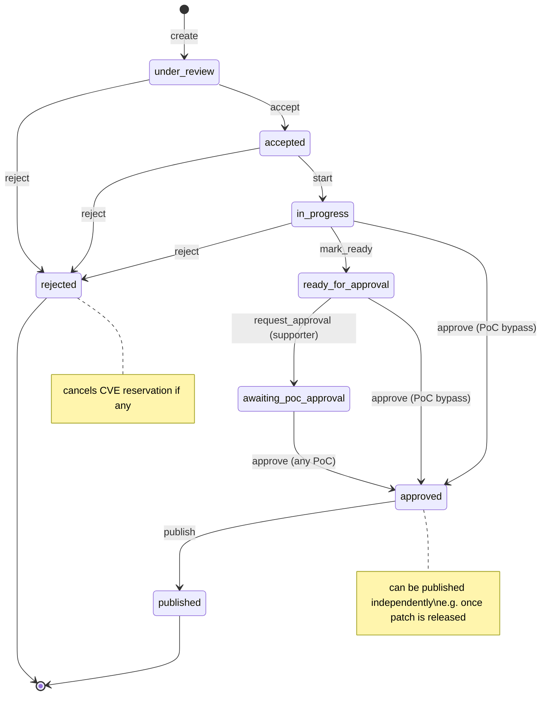

<!--
SPDX-License-Identifier: Apache-2.0
SPDX-FileCopyrightText: 2026 Erlang Ecosystem Foundation
-->

# CVE Case Management System — Specification

## Overview

The Erlang Ecosystem Foundation (EEF) operates as a CVE Numbering Authority (CNA).
This application provides a full case management system for handling vulnerability
reports, coordinating with reporters and maintainers, reserving and publishing CVEs,
and enforcing SLA policies. It replaces manual processes with a structured, auditable,
AI-assisted workflow.

______________________________________________________________________

## Tech Stack

| Layer | Choice |
| --- | --- |
| Language | Elixir |
| Web framework | Phoenix + LiveView |
| Data layer | Ash Framework (Ash, AshPostgres, AshPhoenix) |
| Database | PostgreSQL |
| Auth | AshAuthentication (GitHub OAuth) + Ash Policies |
| Encryption | Ash Cloak (field-level encryption of unpublished vuln data) |
| State machines | ash_state_machine |
| Background jobs | Ash Oban |
| GraphQL API | Ash GraphQL |
| Audit log | Ash Events |
| AI | LangChain for Elixir + ash_ai |
| Email out | Swoosh (SMTP adapter, configurable) |
| Email in | IMAP polling via Oban periodic job |
| GPG | System `gpg` via `System.cmd/3` (see ADR-009) |

______________________________________________________________________

## Domains & Resources

### Domain: Accounts

#### Resource: User

| Field | Type | Notes |
| --- | --- | --- |
| `id` | UUID | |
| `email` | string | |
| `github_id` | string | |
| `github_handle` | string | |
| `name` | string | |
| `role` | enum: `poc`, `supporter` | `poc` = CNA Point of Contact |
| `public_gpg_key` | text (nullable) | Armored public key for GPG replies |
| `inserted_at` | utc_datetime | |
| `updated_at` | utc_datetime | |

- Auth: AshAuthentication with GitHub OAuth strategy
- PoC has full access to all resources; Supporter access is case-gated via `CaseAssignment`

#### Resource: CaseAssignment

| Field | Type | Notes |
| --- | --- | --- |
| `id` | UUID | |
| `case_id` | UUID (FK) | References `Case` |
| `user_id` | UUID (FK) | References `User` (must be `supporter`) |
| `inserted_at` | utc_datetime | |

Grants a Supporter access to a specific Case.

______________________________________________________________________

### Domain: Cases

#### Resource: Case

| Field | Type | Encrypted? | Notes |
| --- | --- | --- | --- |
| `id` | UUID | No | |
| `title` | string | Yes | Encrypted while unpublished |
| `description` | text | Yes | Encrypted while unpublished |
| `severity_estimate` | enum (low/med/high/crit) | No | |
| `status` | enum (see state machine) | No | |
| `cve_reservation_id` | UUID (FK, nullable) | No | |
| `published_at` | utc_datetime (nullable) | No | |
| `approved_at` | utc_datetime (nullable) | No | |
| `approved_by_id` | UUID (FK, nullable) | No | References `User` |
| `rejected_at` | utc_datetime (nullable) | No | |
| `rejection_reason` | text (nullable) | Yes | Encrypted while unpublished |
| `reporter_email` | string | Yes | Encrypted while unpublished |
| `reporter_name` | string | Yes | Encrypted while unpublished |
| `sla_deadline_accept` | utc_datetime (nullable) | No | 2 business days from report |
| `sla_deadline_feedback` | utc_datetime (nullable) | No | 14 days for maintainer feedback |
| `sla_deadline_publish` | utc_datetime | No | 90 days from report; 24h if exploited |
| `publicly_exploited` | boolean | No | Triggers 24h SLA deadline |
| `inserted_at` | utc_datetime | No | |
| `updated_at` | utc_datetime | No | |

Relationships: `has_many :threads`, `has_many :assignments`, `belongs_to :cve_reservation`

**Case Status State Machine** (managed via `ash_state_machine`)



`ash_state_machine` enforces valid transitions. Each transition is an Ash
action with its own Ash Policy. Cases can be rejected from `under_review`,
`accepted`, or `in_progress`.

**Approval flow:**

- Supporter calls `mark_ready` → status becomes `ready_for_approval`
- Supporter calls `request_approval` → status becomes `awaiting_poc_approval`
- Any PoC calls `approve` (from `ready_for_approval` or
  `awaiting_poc_approval`) → `approved`
- PoC can call `approve` directly from `in_progress` (bypass, skips approval queue)
- Once `approved`, the case can be published independently — e.g., the CVE is ready
  but the project has not yet released the patch. `publish` is triggered separately.

#### Resource: CaseThread

| Field | Type | Encrypted? | Notes |
| --- | --- | --- | --- |
| `id` | UUID | No | |
| `case_id` | UUID (FK) | No | |
| `channel` | enum: `email`, `github`, `api`, `internal` | No | |
| `direction` | enum: `inbound`, `outbound`, `internal` | No | |
| `body_raw` | text | Yes | Encrypted while case unpublished |
| `body_html` | text (nullable) | Yes | Encrypted while case unpublished |
| `sender_email` | string (nullable) | Yes | Encrypted while case unpublished |
| `sender_name` | string (nullable) | Yes | Encrypted while case unpublished |
| `message_id` | string (nullable) | No | For email thread matching |
| `in_reply_to` | string (nullable) | No | For email thread matching |
| `gpg_signed` | boolean | No | |
| `gpg_encrypted` | boolean | No | |
| `inserted_at` | utc_datetime | No | |

______________________________________________________________________

### Domain: ReportChannels

#### Resource: EmailMessage

Raw inbound emails, stored before case assignment.

| Field | Type | Notes |
| --- | --- | --- |
| `id` | UUID | |
| `message_id` | string | Email Message-ID header |
| `in_reply_to` | string (nullable) | For threading |
| `from_email` | string | |
| `from_name` | string (nullable) | |
| `subject` | string | |
| `body_text` | text | |
| `body_html` | text (nullable) | |
| `gpg_status` | enum: `none`, `signed`, `encrypted`, `signed_and_encrypted` | |
| `raw_headers` | map (jsonb) | |
| `processed_at` | utc_datetime (nullable) | Null until matched to a case |
| `case_id` | UUID (FK, nullable) | |
| `inserted_at` | utc_datetime | |

On ingest (Oban job):

1. If GPG encrypted → decrypt with CNA private key
1. If GPG signed → verify signature; extract and store sender public key
1. Match to existing case via `in_reply_to` / subject pattern → add `CaseThread`
1. If no match → create new `Case` + `CaseThread`

#### Resource: GitHubReport

| Field | Type | Notes |
| --- | --- | --- |
| `id` | UUID | |
| `github_advisory_id` | string | GHSA identifier |
| `repository` | string | e.g., `owner/repo` |
| `title` | string | |
| `body` | text | |
| `severity` | string (nullable) | |
| `raw_payload` | map (jsonb) | |
| `processed_at` | utc_datetime (nullable) | |
| `case_id` | UUID (FK, nullable) | |
| `inserted_at` | utc_datetime | |

Ingest: Oban periodic job polls GitHub notifications API for the EEF CNA bot account.
On ingest: upsert by `github_advisory_id`, create/update Case, create CaseThread.

#### Resource: ApiReport

Direct API submissions.

| Field | Type | Notes |
| --- | --- | --- |
| `id` | UUID | |
| `api_key_id` | UUID (FK) | References an API key |
| `payload` | map (jsonb) | |
| `processed_at` | utc_datetime (nullable) | |
| `case_id` | UUID (FK, nullable) | |
| `inserted_at` | utc_datetime | |

______________________________________________________________________

### Domain: CVE

#### Resource: CveReservation

| Field | Type | Notes |
| --- | --- | --- |
| `id` | UUID | |
| `cve_id` | string | e.g., `CVE-2025-12345` |
| `status` | enum: `available`, `assigned`, `published`, `cancelled` | |
| `reserved_at` | utc_datetime | |
| `case_id` | UUID (FK, nullable) | Set when assigned to a case |
| `inserted_at` | utc_datetime | |
| `updated_at` | utc_datetime | |

Pool management: Oban periodic job (`TopUpCvePool`) checks count of `available`
reservations. If below a configurable threshold, it calls the MITRE CVE Services
API to reserve a batch. When a case is rejected, its reservation (if any) transitions
to `cancelled`.

#### Resource: CveRecord

| Field | Type | Encrypted? | Notes |
| --- | --- | --- | --- |
| `id` | UUID | No | |
| `case_id` | UUID (FK) | No | |
| `cve_id` | string | No | e.g., `CVE-2025-12345` |
| `cve_json` | map (jsonb) | Yes | CVE JSON 5.x; decrypted on publish |
| `osv_json` | map (jsonb) | Yes | OSV format; decrypted on publish |
| `cvss_vector` | string (nullable) | No | |
| `cvss_score` | decimal (nullable) | No | |
| `cvss_base_severity` | string (nullable) | No | |
| `cwe_ids` | array of strings | No | |
| `capec_ids` | array of strings | No | |
| `description` | text | Yes | Decrypted on publish |
| `workarounds` | text (nullable) | Yes | Decrypted on publish |
| `configurations` | text (nullable) | Yes | Decrypted on publish |
| `patch_url` | string (nullable) | No | |
| `introduced_commit` | string (nullable) | No | |
| `fixed_commit` | string (nullable) | No | |
| `published_at` | utc_datetime (nullable) | No | |
| `inserted_at` | utc_datetime | No | |
| `updated_at` | utc_datetime | No | |

Actions:

- `build` — AI-assisted CVE record construction from case/thread data
- `publish` — sends record to MITRE CVE Services API, marks record public, updates
  reservation status to `published`
- `update` — normal update action; allowed after publish (CVEs can be amended)

______________________________________________________________________

### Domain: AI

#### Resource: AiSkillRun

Immutable audit log of every AI skill invocation.

| Field | Type | Notes |
| --- | --- | --- |
| `id` | UUID | |
| `case_id` | UUID (FK) | |
| `skill` | enum (see below) | |
| `input_snapshot` | map (jsonb) | Snapshot of inputs at run time |
| `output` | map (jsonb) | Structured output from the skill |
| `model` | string | Model identifier used |
| `status` | enum: `pending`, `running`, `completed`, `failed` | |
| `inserted_at` | utc_datetime | |

**AI Skills** (each a separate LangChain chain module; ash_ai for action-aware tool
calls)

| Skill | Description |
| --- | --- |
| `triage` | Determines if the report qualifies as a CVE (yes/no + reasoning) |
| `cvss_assist` | Suggests a CVSS vector with per-field reasoning |
| `cwe_capec` | Suggests CWE IDs and CAPEC IDs |
| `description_writer` | Drafts description, workarounds, and configurations text fields |
| `introducing_commit` | Bisects/searches source repo to find the commit that introduced the bug |
| `patch_locator` | Checks source repo + Hex.pm for patch releases; updates CVE fields |
| `prioritization` | Scores urgency relative to current open case queue |

Each skill is invoked from a LiveView action and results stream back to the UI.
Results are stored in `AiSkillRun`. Users can accept, edit, or reject AI suggestions
before saving.

______________________________________________________________________

### Domain: SLA

SLA enforcement is handled by the `SlaEnforcement` Oban job (hourly). It does not
have its own DB resource but emits Ash Events on breaches and updates breach flags
on `Case`.

#### SLA Rules

| Rule | Deadline | Trigger |
| --- | --- | --- |
| Publicly exploited vuln | 24 hours from report | `Case.publicly_exploited = true` |
| Accept/reject report | 2 business days from report | Always |
| Maintainer feedback timeout | 14 days — publish without patch | If no maintainer reply by then |
| Total deadline | 90 days from report | Always |

On breach: emit Ash Event, set breach flag on `Case`, surface in LiveView dashboard.

______________________________________________________________________

### Domain: GPG

The CNA keypair (private key in env/secrets, never persisted to DB) is used for:

- **Inbound email decrypt**: If body is encrypted with the CNA public key, decrypt
  before storing
- **Inbound signature verify**: Verify sender signatures; extract and store sender
  public key
- **Outbound sign**: All outbound emails signed with the CNA private key
- **Outbound encrypt**: If a recipient public key is available (from
  `User.public_gpg_key` or `ContactGpgKey`), encrypt the reply

#### Resource: ContactGpgKey

Public keys for Case Contacts who have no User record.

| Field | Type | Notes |
| --- | --- | --- |
| `id` | UUID | |
| `email` | string | |
| `armored_key` | text | PEM/armored public key |
| `fingerprint` | string | Key fingerprint for dedup |
| `inserted_at` | utc_datetime | |

______________________________________________________________________

## Access Control

Ash Policies are the single source of truth for authorization. No ad-hoc checks
in controllers or LiveViews.

| Actor | Access |
| --- | --- |
| `poc` | Full access to all resources and all actions |
| `supporter` | Can create cases; access cases with a `CaseAssignment`; can assign CVE ID reservation; cannot publish without PoC approval |
| Case Contact | `Phoenix.Token` (signed, expiring) in URL; read-only access to their specific case + threads |
| Public | Read published `CveRecord` only (CVE JSON, OSV JSON); no auth required |

______________________________________________________________________

## API Layer

### Ash GraphQL

- Authenticated (poc / supporter) access to all case management mutations and queries
- Public queries for published `CveRecord`s

### REST Controllers (Phoenix)

**CveController** — serves CVE JSON 5.x format

- `GET /api/cves` — index of all published CVEs
- `GET /api/cves/:cve_id` — detail for a single CVE

**OsvController** — serves OSV JSON format

- `GET /api/osv` — index of all published CVEs in OSV format
- `GET /api/osv/:cve_id` — detail for a single CVE in OSV format

______________________________________________________________________

## LiveView UI

| Route | Description | Access |
| --- | --- | --- |
| `/` | Public dashboard: list of published CVEs | Public |
| `/cases` | Case list with SLA status indicators | poc, supporter |
| `/cases/new` | New case form | poc, supporter |
| `/cases/:id` | Case detail: threads, SLA, assignment | poc, supporter |
| `/cases/:id/cve` | CVE record builder with AI skill panel | poc, supporter |
| `/cases/:id/approve` | Approval action | poc |
| `/cases/:id/publish` | Publish action | poc |
| `/reservations` | CVE ID pool management | poc |
| `/admin/users` | User management, role assignment | poc |
| `/c/:token` | Case Contact view (token-authenticated, read-only) | Case Contact |

______________________________________________________________________

## Background Jobs (Ash Oban)

| Job | Schedule | Description |
| --- | --- | --- |
| `PollGitHubNotifications` | every 5 min | Poll GitHub notifications API for CNA bot account |
| `PollImap` | every 2 min | Poll IMAP inbox; ingest new emails |
| `TopUpCvePool` | every 15 min | Reserve CVE IDs from MITRE if pool below threshold |
| `SlaEnforcement` | every 1 hour | Check open cases for SLA breaches; emit events |
| `SendEmail` | triggered | Send outbound email via Swoosh (GPG sign/encrypt) |
| `PublishToCveServices` | triggered | Submit published CVE record to MITRE CVE Services API |

______________________________________________________________________

## Key Elixir Dependencies

```elixir
# Ash ecosystem
{:ash, "~> 3.0"},
{:ash_postgres, "~> 2.0"},
{:ash_phoenix, "~> 2.0"},
{:ash_authentication, "~> 4.0"},
{:ash_authentication_phoenix, "~> 2.0"},
{:ash_graphql, "~> 1.0"},
{:ash_oban, "~> 0.2"},
{:ash_events, "~> 0.1"},
{:ash_cloak, "~> 0.1"},
{:ash_state_machine, "~> 0.2"},
{:ash_ai, "~> 0.1"},

# Infrastructure
{:oban, "~> 2.0"},
{:swoosh, "~> 1.0"},
{:mail, "~> 0.3"},         # IMAP polling + email parsing

# AI
{:langchain, "~> 0.3"},

# Web
{:phoenix, "~> 1.7"},
{:phoenix_live_view, "~> 1.0"},
{:postgrex, "~> 0.18"},
```

GPG: call system `gpg` via `System.cmd/3` with strict input sanitization. Evaluate
`:gpgex` as an alternative native binding (see ADR-009).

______________________________________________________________________

## Verification & Testing Strategy

- **Schema**: `mix ash.codegen` + `mix ecto.migrate` confirms all resources generate
  valid migrations

- **Policies**: `Ash.can?/3` assertion tests for every role × resource × action
  combination

- **State machine**: Transition tests asserting invalid transitions raise errors

- **Oban jobs**: `Oban.Testing` helpers for unit and integration job tests

- **LiveView**: `Phoenix.LiveViewTest` for UI flows

- **AI skills**: Mock LangChain adapters (record/replay) for deterministic tests

- **REST controllers**: `conn` tests validating CVE JSON 5.x and OSV JSON schema

- **GPG**: Fixture keypair for encrypt/decrypt/sign/verify round-trip tests

- **SLA**: Create case → set `inserted_at` in the past → run `SlaEnforcement` job
  → assert breach event

______________________________________________________________________

## Open / Deferred Decisions

- **GitHub Advisory channel**: TBD whether EEF uses a GitHub App (webhook) or bot
  account (notification polling). Spec covers the bot/polling path; webhook can
  be added later as a second `ReportChannel` strategy. See ADR-007.
- **Embargo / coordinated disclosure**: `published_at` can be set to a future date
  and the `publish` action can check it, but a full embargo workflow is out of scope
  for v1.
- **CVSS version**: Spec assumes CVSS 3.1; CVSS 4.0 support can be added alongside.
